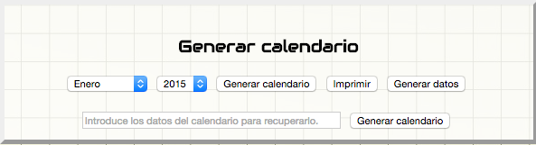
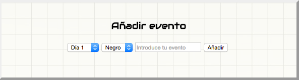
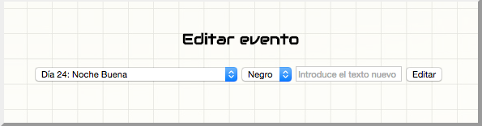
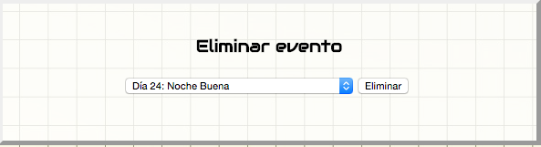

# Calendario automático - Manual de uso
Este calendario automático dispone de los siguientes elementos:
* Cuadro para generar calendario

* Cuadro para añadir eventos

* Cuadro para editar eventos

* Cuadro para eliminar eventos

## Generar calendario según mes y año introducidos
Para generar el calendario según un mes y un año basta con elegir el mes y el año en los desplegables y hacer click en el botón "Generar calendario".

## Eventos
### Añadir eventos
Al añadir un evento en el cuadro con nombre "Añadir evento" podemos elegir el día en el que pondremos el evento, el color que queremos que tenga en el calendario y el texto. Finalmente usamos el botón "Añadir".

### Editar eventos
Al añadir un evento en el cuadro con nombre "Editar evento" podemos elegir el evento que queremos editar, el color nuevo que queremos que tenga en el calendario y el texto modificado. Finalmente usamos el botón "Editar".

### Añadir eventos
Para eliminar un evento en el cuadro "Eliminar evento" elegimos el evento en el desplegable y pulsamos el botón "Eliminar".

## Generar datos del calendario
Si queremos guardar los datos del calendario para cargarlo en otro momento y poder editar los datos, simplemente, pulsamos el boton "Generar datos" que se encuentra en el cuadro "Generar calendario".

Esto nos dará un texto, que podremos copiar en un fichero, con los datos del calendario actual.

## Generar calendario según datos
Si hemos generado los datos de un calendario podremos recuperarlos para generar con ellos un calendario que ya teníamos y seguir editandolo.

Para ello, basta con introducir en el campo de texto del cuadro "Generar calendario" los datos del calendario y hacer click en el botón "Generar calendario" que está al lado del campo de texto.

## Imprimir
Al imprimir el calendario, al menos en Google Chrome, podemos ajustar los márgenes de la página para que el calendario quede ajustado en la página.
